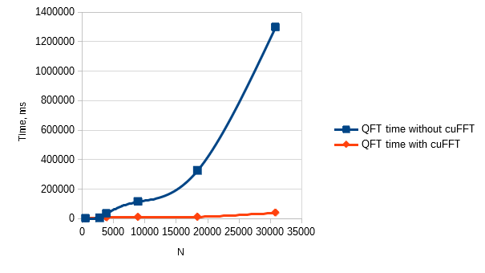

# Shor-cuda-optimize
An optimization of existing Shor's algorithm implementation using CUDA cuFFT library. The original simulator was implemented by user jtiosue: https://github.com/jtiosue/Quantum-Computer-Simulator-with-Algorithms

## How to run
On windows, the project can be built and run using Visual Studio 2019 with CUDA support enabled.

On Linux, make sure you have gcc-8 and cuda 10.2. Then you can type:
```
make all
./program
```

## Optimization goal and results

Profiling has shown that nearly 95% of Shor's algorithm simulation was dedicated to the Quantum Fourier Transform calculation. Based on the fact that QFT can be calculated using Fast Fourier Transform algorithm, I've decided to use CUDA implementation of such algorithm, called cuFFT, to speed up the calculation.

In the result, the calculation of QFT was sped up by approx. 30 times.


